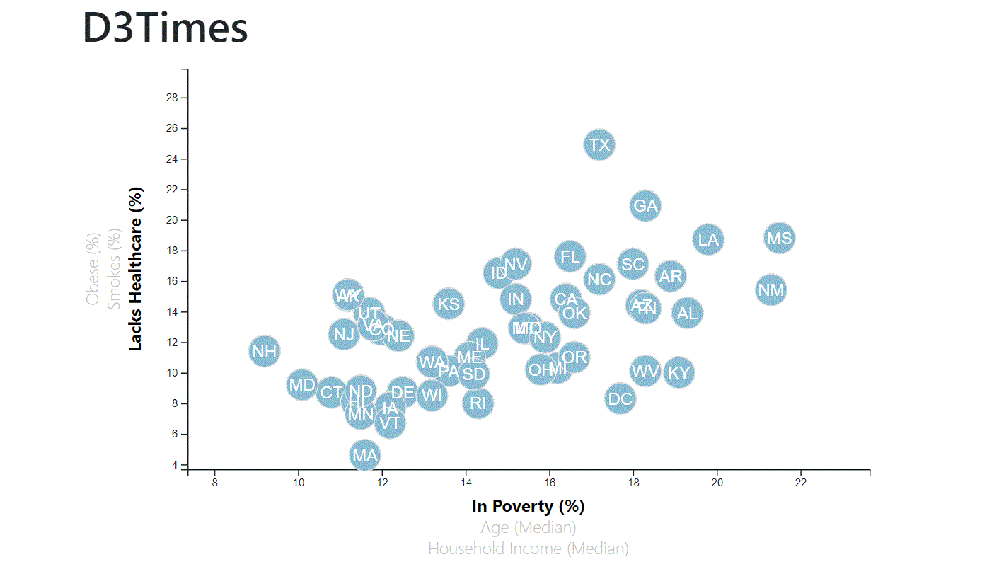

# Data-Journalism-and-D3

For this project, the task is to analyze the trends about 
the health risks facing particular demographics from a set of data from the U.S. Census Bureau and the Behavioral Risk Factor Surveillance System.

data source: 2014 ACS 1-year estimates from the [US Census Bureau](https://data.census.gov/cedsci/)

### Core Assignment: D3 Dabbler

The core task was to  create a scatter plot between two of the data variables such as `Healthcare vs. Poverty` or `Smokers vs. Age`. Using D3 to show the states with circle elements, and making the scatter plot ultimately appear in the page. 

#### 1. More Data, More Dynamics

The optimal assigment was to make a responsive, interactive data visualization out of the data. Using animations for the circles' locations as well as the range of the axes, also tooltips that allow to infer approximate values for each circle. 

The final result turned out like this: 

Also, return a analysis form the obtained data and the graph.

- - -

© 2021 Trilogy Education Services, LLC, a 2U, Inc. brand. Confidential and Proprietary. All Rights Reserved.

